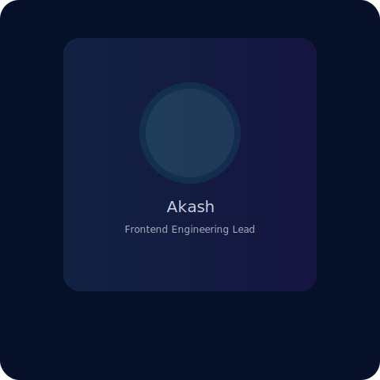
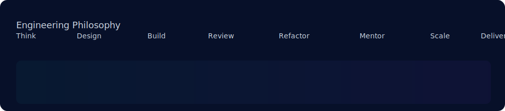
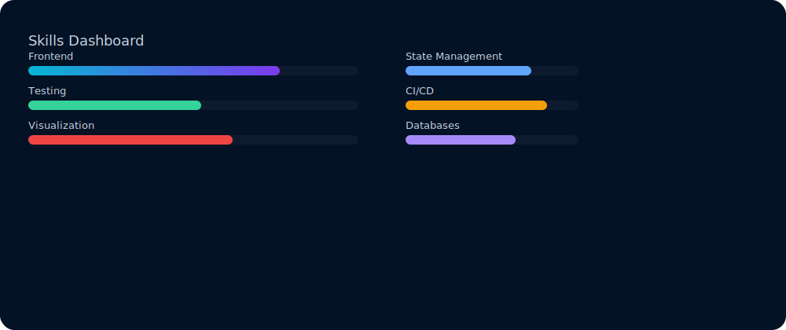

<!--
  GitHub Profile Repository for Akash Kumawat
  Premium, production-ready, handcrafted README
  Replace: resume_url, portfolio_url, linkedin_url, project links as needed
-->

  

 
  

# Akash Kumawat — Frontend Engineering Lead

Frontend Engineering Lead based in Pune, India. 8.6+ years building scalable enterprise applications, leading modernization efforts, and mentoring teams to deliver production-grade UI architecture.

- Location: Pune, Maharashtra, India
- Role: Frontend Engineering Lead
- Experience: 8.6+ years

---

## Quick Actions

- **Resume:** [Download Resume](https://example.com/akash-kumawat-senior-frontend-engineer-cv.pdf)
- **Portfolio:** [View Portfolio](https://akash-kumawat.web.app)
- **LinkedIn:** [Connect on LinkedIn](https://www.linkedin.com/in/akash-r-kumawat/)
- **Email:** [akash.kumawat.r@gmail.com](mailto:akash.kumawat.r@gmail.com)

---

## Professional Introduction

I design and deliver enterprise-grade frontend systems focused on architecture, maintainability, and performance. I lead cross-functional teams, drive Angular modernization, and craft component libraries that scale across products.

---

## Engineering Philosophy

Think ▸ Design ▸ Build ▸ Review ▸ Refactor ▸ Mentor ▸ Scale ▸ Deliver Value

---

## Current Focus

- Leading Angular modernization and migrations (AngularJS → Angular 21)
- Component-driven architecture and design systems
- Introducing Angular Signals and performance-first patterns
- Jest-first testing strategy and developer ergonomics

---

## Professional Highlights

- Led enterprise migrations for BFSI and Supply Chain clients.
- Architected reusable component libraries with TypeScript-first APIs.
- Improved performance and TTI across large single-page apps.
- Mentored teams in testing, CI/CD, and frontend architecture.

---

## Skills Overview

**Frontend:** Angular (2–21), AngularJS, React, TypeScript, JavaScript, HTML5, CSS3, SCSS

**State Management:** NgRx, Redux, Signals

**Component / UI:** Angular Material, PrimeNG, Storybook

**Testing:** Jest, Cucumber, Puppeteer

**Backend & DevOps:** Node.js, Java, Elasticsearch, Couchbase, Git, CI/CD (Jenkins, GitHub Actions)

**Visualization:** Highcharts, Google Charts

**Methodologies:** Agile, Scrum, Code Reviews, Architectural Reviews, Performance Optimization

---

## Career Timeline

**Technology Apprentice** → **Associate Technology Scientist** → **Senior Software Engineer** → **Technical Lead** → **Senior Software Engineer** → **Project Lead** → **Frontend Engineering Lead**

---

## Enterprise Domain Experience

- BFSI, Supply Chain, E-Commerce, Digital Wellbeing, Product Management

---

## Selected Professional Experience

### Persistent Systems — Project Lead (Oct 2024 – Present)
- Leading enterprise modernization projects and Angular migrations.
- Architecting reusable frontend components, introducing Angular Signals.

### Ideas To Impacts Digital — Senior Software Engineer (Jan 2024 – Sep 2024)
- Contributed to Siemens Enterprise Web Framework using React + TypeScript.

### Magic Flare Software Solutions — Technical Lead / Senior Software Engineer
- Built reusable libraries, integrations with Google Maps, PrimeNG, and NgRx.

### DataDynamics — Senior Software Engineer
- Enterprise dashboards, Highcharts, Elasticsearch, CI pipelines.

---

## Featured Projects

> Each card links to the repository and demo — replace URLs with actual project links.

### Project: Enterprise Component Library

- Image: 
- Description: A TypeScript-first, themable component library for enterprise apps. Focus on accessibility, testability, and predictable API.
- Tech: Angular, TypeScript, Storybook, NgRx, Jest
- Status: Production
- Difficulty: Advanced
- [GitHub](https://github.com/REPLACE/enterprise-component-library) • [Demo](https://example.com/demo)

### Project: Angular Modernization Suite

- Image: 
- Description: Migration tooling, codemods, and scaffolding for upgrading AngularJS apps to Angular 21.
- Tech: Angular, Schematics, TypeScript
- Status: Active
- Difficulty: Complex
- [GitHub](https://github.com/REPLACE/angular-modernization) • [Demo](https://example.com/modernization)

---

## Achievements

Click to expand professional achievements

- Delivered enterprise migrations reducing bundle sizes by up to 40%.
- Designed reusable component API patterns adopted across multiple product teams.
- Presented internal lightning talks and onboarding sessions for frontend best practices.

---

## Learning Roadmap & 2026 Goals

- Master advanced Angular internals and Signals-driven patterns.
- Build a public, enterprise-grade component scaffolding tool.
- Publish articles on frontend architecture and testing strategies.

---

## Open Source Vision

I focus on infrastructure that helps teams ship reliably: tooling for migrations, testing, and component reuse.

---

## GitHub Widgets

| GitHub Stats | Top Languages |
|---|---|
|  |  |

| Contribution Graph | Streak |
|---|---|
|  |  |

| Trophies | Visitor Count |
|---|---|
|  |  |

---

## How I Work

- Architecture-first: start with a thin, practical architecture and evolve through feedback.
- Component-driven: prioritize contracts, immutability, and strong typings.
- Testable: prefer unit-tested primitives and end-to-end scenarios.
- Mentor-first: pair-programming, reviews, and technical onboarding.

---

## Let's Connect

- Portfolio: https://example.com/portfolio
- Resume: https://example.com/resume.pdf
- Email: akash.kumawat@example.com

---

Made with focus on architecture, quality, and craft.

